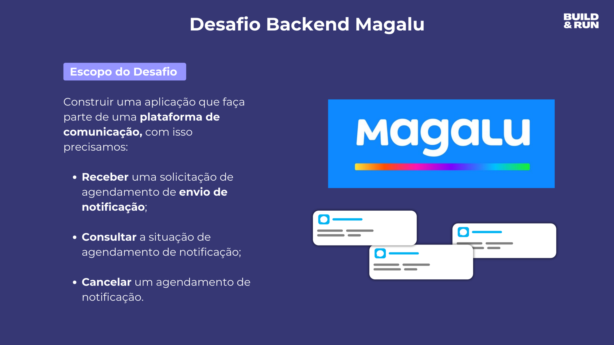
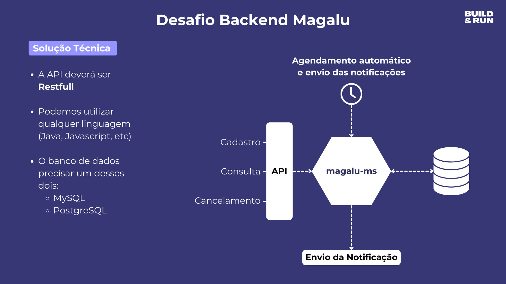
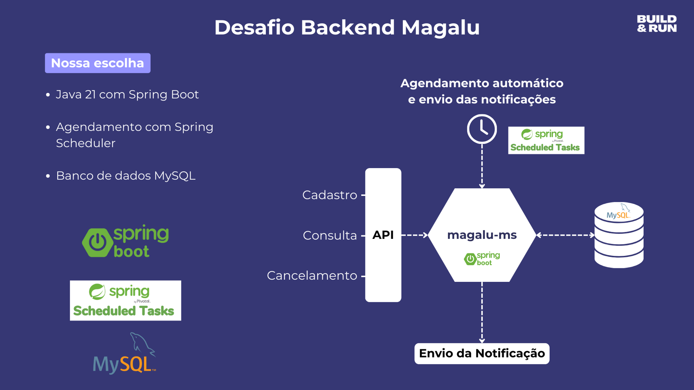
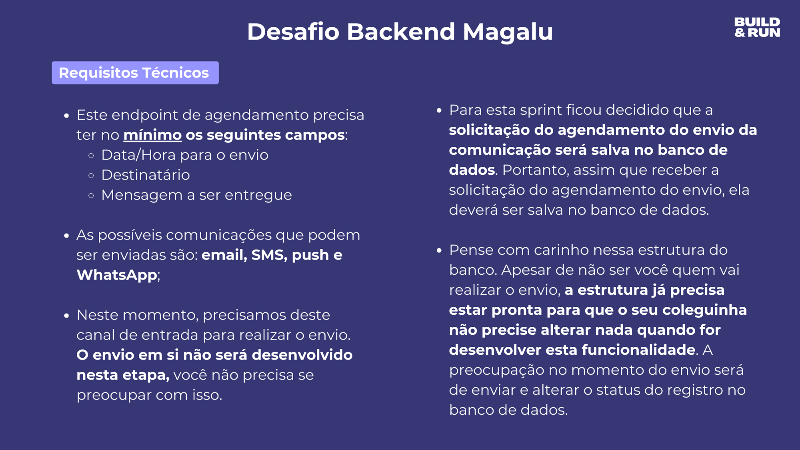

# Desafio Magalu

## 🚀 Tecnologias utilizadas
* Java 21
* Spring Boot
* Spring Data JPA
* Spring Scheduler
* Spring Scheduler
* Docker

## Interação com o banco de dados

* [Accessing data with MySQL](https://spring.io/guides/gs/accessing-data-mysql)

* Opcional [Beekeeper Community](https://github.com/beekeeper-studio/beekeeper-studio/releases/tag/v4.1.13)

**Resolveremos o Desafio Backend da Magalu e aprenderemos:**

- Como criar um microserviço com Spring Boot
- Como realizar tasks agendadas com Spring Scheduler
- Como comunicar com o banco de dados MySQL via Docker
- Queries customizadas com Spring Data JPA
- Relacionamento ManyToOne com JoinColumn
- Como efetuar logs com o SLF4J

### Lista de tarefas:

Introdução:

- [X]  Qual é o desafio que vamos resolver?

---

Comunicação com o banco e dados:

- [X]  Iniciando o projeto Java (Web, Spring Data JPA, MySQL)
- [X]  Configurando o MySQL no Docker
- [X]  Configurando a comunicacao do Spring Boot com o MySQL

---

Funcionalidade de solicitação de agendamento de notificação:

- [X]  Mapear as entidades (Notification, Channel e Status)
- [X]  Criar config de inicialização das tabelas (Channel e Status)
- [X]  Criar API de solicitação de agendamento de notificação
- [X]  Criar serviço de persistência da solicitação
- [X]  Testar o fluxo (api → service → mysql)

---

Funcionalidade de consultar a situação de agendamento de notificação:

- [ ]  Criar API de consulta de solicitação de agendamento de notificação
- [ ]  Criar serviço de consulta
- [ ]  Testar a API

---

Funcionalidade de cancelamento de agendamento de notificação:

- [ ]  Criar API de cancelamento de agendamento de notificação
- [ ]  Criar serviço de cancelamento
- [ ]  Testar a API

---

Rotina de checagem e envio de notificação:

- [ ]  Criar rotina de checagem via Spring Scheduler
- [ ]  Testar se a rotina está funcionado
- [ ]  Criar serviço de consulta de notificações disponíveis para envio
- [ ]  Criar mock de envio de notificação com logging
- [ ]  Criar serviço que atualiza o status da notificação
- [ ]  Testar o fluxo completo (api → agendamento → rotina → envia notificacao → atualiza base)